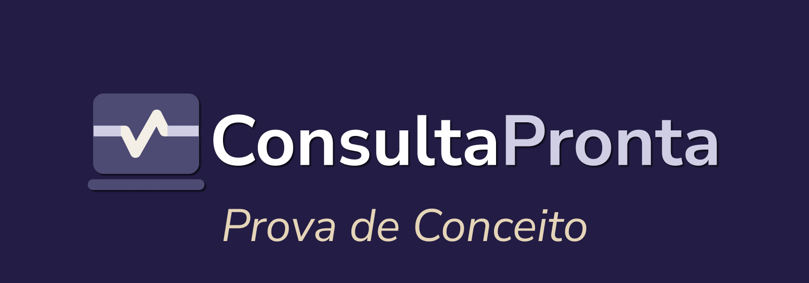

ConsultaPronta é uma plataforma inteligente para triagem, direcionamento e acompanhamento da saúde do paciente, facilitando a comunicação com profissionais de saúde.

Esse repostitório apresenta uma implementação web reduzida do projeto ConsultaPronta com as funcionalidades principais do aplicativo, ao menos aquelas relacionadas com as tabelas principais dentro do banco de dados apresentado nas [especificações](https://github.com/leafcabral/consulta-pronta-spec).

> [!NOTE]  
> AS tecnologias utlizadas nessa implementação irão ser consideravelmente diferentes da implementação final
